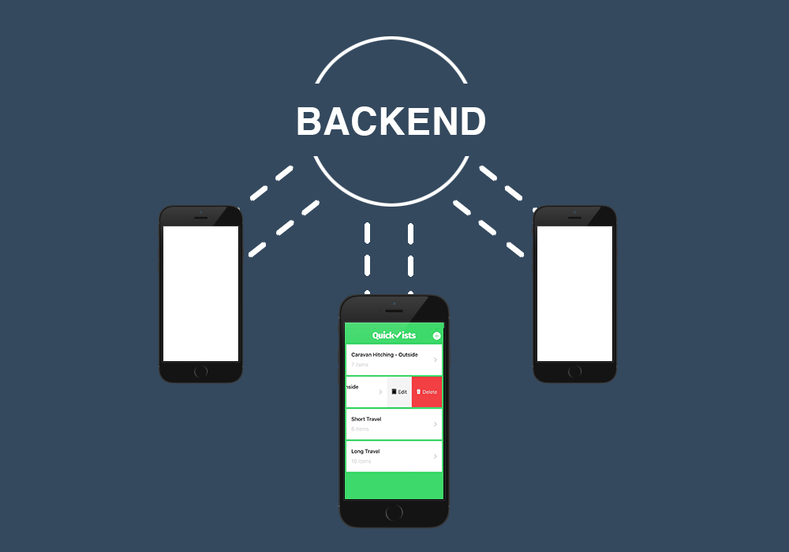
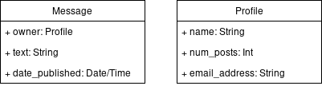

# Tutorial for creating RESTful Backends

---

# Agenda

Introduction to create a simple REST backend.



- **What is REST and why to use it?**
- How an REST app works?
- Lets build a simple application - Chat app
- Two main parts of our app - State and Functionality
- What should it remember? - How to store the state?
- What should it do? - How to implement functionality?
- Final application
- How to run it? - locally and on cloud?
- What are alternate tools to build backends?

---

# What is REST

## REpresentational State Transfer

An **architectural style** for systems **to communicate on web**.

---
# What is REST

## Main Characteristics of an REST architectural style

---
# What is REST

# Main Characteristics of an REST architectural style

## Uniform Interface

for accessing server resources

- Identification of resources (URL).
- Manipulation of resources (use CRUD commands to manipulate).
- Self-descriptive messages (about Errors or Warnings or Success).

---

# What is REST

# Main Characteristics of an REST architectural style

## Stateless 

- Each request must contain all of the information necessary to understand the request.
- *Advantages*: Reliability is improved because it eases the task of recovering from partial failures of server.
- *Disadvantage*: It may decrease network performance (due to large packet sizes).

---

# What is REST

# Main Characteristics of an REST architectural style

## Cacheable

- Responses have to be capable of being labeled as cacheable or non-cacheable. 
- By labeling as cacheable, client cache is given the right to reuse that response data for later equivalent request.
- *Advantages*: eliminates some interactions, improves efficiency, scalability, and user-perceived performance.
- *Disadvantage*: decrease reliability if stale data within the cache differs significantly from the data that would have been obtained had the request been sent directly to the server.
---

# What is REST

# Main Characteristics of an REST architectural style

## Pull-based interaction style

- Only emitting a notification upon receipt of a request
- Although this is less efficient when viewed as a single client wishing to monitor a single resource, the scale of the Web makes an unregulated push model infeasible

---

# Why to use REST ? Advantages

- Code one API and build as many types of clients (web, mobile web, phone, tablet) you want (due to uniform Interface of REST)
- Scalable (as you cache and servers only have to respond to requests)
- Reliable (as it is stateless, don't have to worry about server failures)

---
# Agenda

Introduction to create a simple REST back-end.


- What is a REST application and why to use it?
- **How an REST app works?**
- Lets build a simple application - Chat app
- Two main parts of our app - State and Functionality
- What should it remember? - How to store the state?
- What should it do? - How to implement functionality?
- Final application
- How to run it? - locally and on cloud?
- What are alternate tools to build back-ends?

---

# How an REST app works? - HTTP protocol

- REST is usually implemented over HTTP protocol
- Having said that REST itself is independent of any particular network protocol

---

# How an REST app works?

- URLs to represent objects
- HTTP Verbs
- Data format of HTTP response
- Response codes
- Cache control

---

# How an REST app works?

## URLs to represent resources

sample URL to access a backend resource

```http://example.com/resource```
To pass some value to backend

```http://example.com/resource?parameter=value```
To pass more than one value to backend

```http://example.com/update_widget?parameter1=value1&parameter2=value2```


---

# How an REST app works?

## HTTP Verbs

- GET - to read the resource
- PUT - modify the resource
- POST - create the resource
- DELETE - delete the resource

---

# How an REST app works?

## Example of usage of HTTP verbs

- If we wanted to view all the resources in the server, the URL would look like this:

	``` GET http://example.com/resources ```
- Create a new resource by posting the data:

	``` POST http://example.com/resources?newresourceid = value ```
- To view a single resource we "get" it by specifying that resource's id:

	```GET http://example.com/resources/resourceid```

---
# How an REST app works?

## Example of usage of HTTP verbs


- Update newly created resource by "putting" the new data:

	```PUT http://example.com/resources/resourceid?parameter = new value```
- Delete that resource:

	```DELETE http://example.com/resources/resourceid```

---

# How an REST app works?

## Data format of HTTP response - JSON

Sample JSON object of response object

	!json 
	
	{
	    "name":"John",
	    "age":30,
	    "cars": {
	        "car1":"Ford",
	    }
	 }

---

# How an REST app works?

## Response codes

Here's a list of the most important status codes:

* 2xx = Success
	- 200 - OK (the default)
	- 201 - Created
	- 202 - Accepted (often used for delete requests)
* 3xx = Redirect
---

# How an REST app works?

## Response codes

* 4xx = User error
	- 400 - Bad Request (generic user error/bad data)
	- 401 - Unauthorized (this area requires you to log in)
	- 404 - Not Found (bad URL)
	- 405 - Method Not Allowed (wrong HTTP method)
	- 409 - Conflict (i.e. trying to create the same resource with a PUT request)
* 5xx = Server error

---

# Agenda

Introduction to create a simple REST backend.


- What is a REST application and why to use it?
- How an REST app works?
- **Lets build a simple application - Chat app**
- Two main parts of our app - State and Functionality
- What should it remember? - How to store the state?
- What should it do? - How to implement functionality?
- Final application
- How to run it? - locally and on cloud?
- What are alternate tools to build backends?

---

# Lets build a simple application - Chat app

The app we are building is a  very basic IRC application, if you need a quick introduction on IRC,
its, its a way better and older version of SLACK!

The idea is simple, a basic IRC server with no authentication and a single room.
Multiple clients can talk to the IRC server, each client can post a message as as retrieve all
messages that are posted. Messages are sorted on the server based on the time they are received.

In real IRC, there is the concept of rooms ( equivalent of channels in slack ), however for this
sample program we will only have one default room/channel.


## Frameworks:
There are many frameworks we can use to create convenience:

    * Django
    * Flask
    * Ruby On Rails
    * ASP.net
    * etc...

For the most part most of these frameworks only differ in syntax, language, and design methodology
( how they expect you to do stuff ). The underlying principles and concepts always carry over!


## Django
In this course we will be using Djang. Thus this tutorial will be both a general backend and a
mini-django tutorial.

If you are going to use Django in your project, I recommend looking at the official Django tutorial
[Django Official Tutorial]

// TODO Reason

[Django Official Tutorial]: https://docs.djangoproject.com/en/2.1/intro/

---

# Agenda

Introduction to create a simple REST backend.


- What is a REST application and why to use it?
- How an REST app works?
- Lets build a simple application - Chat app
- **Two main parts of our app - State and Functionality**
- What should it remember? - How to store the state?
- What should it do? - How to implement functionality?
- Final application
- How to run it? - locally and on cloud?
- What are alternate tools to build backends?

---

# Two main parts of our app - State and Functionality

Many design patterns e.g. MVC ( which Django psudo uses ) seperate state and functionality.

Here, state referes to the data stored by the site/backend. In our example this may include things
like the message.

On the other hand when we talk about functionality, we refer to the actions taken when a client hits
an endpoint.


// TODO include reason as to why this seperation is good

---
# Agenda

Introduction to create a simple REST backend.


- What is a REST application and why to use it?
- How an REST app works?
- Lets build a simple application - Chat app
- Two main parts of our app - State and Functionality
- **What should it remember? - How to store the state?**
- What should it do? - How to implement functionality?
- Final application
- How to run it? - locally and on cloud?
- What are alternate tools to build backends?

---

# What should it remember? - How to store the state?

For our chat application there are 2 things we need to store:

    1. Messages
    2. Profile/User data

Bellow is a diagram that should help illustrate some of the things each piece of state




## Where and how to store this information


---
# Agenda

Introduction to create a simple REST backend.


- What is a REST application and why to use it?
- How an REST app works?
- Lets build a simple application - Chat app
- Two main parts of our app - State and Functionality
- What should it remember? - How to store the state?
- **What should it do? - How to implement functionality?**
- Final application
- How to run it? - locally and on cloud?
- What are alternate tools to build backends?

---
# Agenda

Introduction to create a simple REST backend.


- What is a REST application and why to use it?
- How an REST app works?
- Lets build a simple application - Chat app
- Two main parts of our app - State and Functionality
- What should it remember? - How to store the state?
- What should it do? - How to implement functionality?
- **Final application**
- How to run it? - locally and on cloud?
- What are alternate tools to build backends?

---
# Agenda

Introduction to create a simple REST backend.


- What is a REST application and why to use it?
- How an REST app works?
- Lets build a simple application - Chat app
- Two main parts of our app - State and Functionality
- What should it remember? - How to store the state?
- What should it do? - How to implement functionality?
- Final application
- **How to run it? - locally and on cloud?**
- What are alternate tools to build backends?

---
# Agenda

Introduction to create a simple REST backend.


- What is a REST application and why to use it?
- How an REST app works?
- Lets build a simple application - Chat app
- Two main parts of our app - State and Functionality
- What should it remember? - How to store the state?
- What should it do? - How to implement functionality?
- Final application
- How to run it? - locally and on cloud?
- **What are alternate tools to build backends?**
