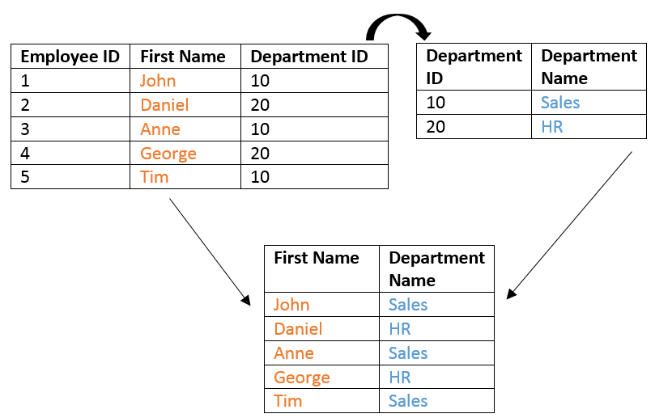

# 
## **Tutorial for creating RESTful backend**


---

# Agenda

Introduction to create a simple REST backend.


- **Backend basics**
- Design a simple backend - chat app
- Implement the chat app in python
---

# Backend basics

## What is a backend?

- Backend a program that receives requests from clients and responds with appropriate data
- Ex: your Facebook app has to talk to a Facebook backend to get all the data required for its working.

## What is a server?

- Server is a computer that runs your backend.
- This server can be located any where in the world and your client connects using a network.

---
# Backend basics

## How client and server communicate

- Server can be uniquely identified using IP:PORT combination 
- Ex: for an HTTPS server the combination can be 192.168.1.255:8080
- IP address is a unique number given to a computer
- PORT is used to identify a particular program running inside that computer
- DNS name is an English name for IP address and can be used in the place of IP to connect to server.

---
# Backend basics

## How client and server communicate

- A network protocol is set of rules two computers use to talk between each other.
- HTTP is most common protocol used by all systems in web.
- HTTP clients (ex: browser) can make requests to HTTP backends and can get responses back.
- In this tutorial, we will be creating a HTTP backend.

---
# Backend basics

## What is cloud and what is a VM

- In cloud computing, you will rent a server from a cloud provider and pay only for what you use.
- To be cost effective cloud provider will virtually share a physical machine between different clients.
- The part of machine each client gets is called a virtual machine.
- For this course, you can use azure virtual machines to run your backends. 

---

# Backend basics

## Azure - Demo

- Create a virtual machine
- Login to virtual machine from local desktop.
- Transferring and running a program in virtual machine

---

# Backend basics

## SQL Database

- An SQL Database is a collection of persistent tables.
- SQL language can be used to query a database to get required data.
- Primary key is used to uniquely identify each row.
- Example of a database:


---

# Backend basics

## What is an REST API

- API is an interface used to access an resource in the server.
- You can think of a resource as an object in Java. 
- API is independent of any programming language, and helps clients and servers written in any programming language to communicate.

---

# Backend basics

## Advantages of REST API

- Code one API and build as many types of clients (web, mobile web, phone, tablet) you want (due to uniform Interface of REST)
- Scalable (as you can cache server responses)
- Reliable (as it is stateless, don't have to worry about server failures)

---

# Backend basics

## URL

Each REST api will have one unique URL 

Example URLs to access a backend resource

```http://example.com/resource```

To pass some value to backend

```http://example.com/resource?parameter=value```

To pass more than one value to backend

```http://example.com/update_widget?parameter1=value1&parameter2=value2```

---

# Backend basics

## HTTP Verbs

Below are the functions that can be defined on each server resource and can be executed through a HTTP request

- GET - to read the resource
- PUT - modify the resource
- POST - create the resource
- DELETE - delete the resource

---

# Backend basics

## Example of usage of HTTP verbs

- If we wanted to view all the resources in the server, the URL would look like this:
	
	``` GET http://example.com/resources ```

- Create a new resource by posting the data:
  	
  	``` POST http://example.com/resources?new_resourceid = value ```

- To view a single resource we "get" it by specifying that resource's id:
  	
  	```GET http://example.com/resources/resourceid```

---
# Backend basics

## Example of usage of HTTP verbs


- Update newly created resource by "putting" the new data:

	```PUT http://example.com/resources/resourceid?parameter = new value```

- Delete that resource:

	```DELETE http://example.com/resources/resourceid```

---

# Backend basics

## Data format of HTTP response - JSON

Server usually send data back upon a request in HTTP response.

Sample JSON object of response object

	!json 

	{
	    "parameter":"value",
	    "parameter":number,
	    "nested parameter": {
	        "parameter":"value",
	    }
	 }

---

# Backend basics

## Response codes

When server detects a error, it will send some standard error codes to client.

These error codes have to be used as they defined in the standard

Here's a list of the most important status codes:

* 2xx = Success
	- 200 - OK (the default)
	- 201 - Created
	- 202 - Accepted (often used for delete requests)
* 3xx = Redirect
---

# Backend basics

## Response codes

* 4xx = User error
	- 400 - Bad Request (generic user error/bad data)
	- 401 - Unauthorized (this area requires you to log in)
	- 404 - Not Found (bad URL)
	- 405 - Method Not Allowed (wrong HTTP method)
	- 409 - Conflict (i.e. trying to create the same resource with a PUT request)
* 5xx = Server error

---

# Backend basics

## Cache control

- The network between client and server can have a cache which will store most recent responses for each request.
- Ex: each web browser gets a cache

In HTTP header, an REST server can specify weather to store the response in the cache and for how long

```
Cache-Control: no-cache
Cache-Control: max-age=<seconds>
```
---

# Agenda

Introduction to create a simple REST backend.


- Backend basics
- **Design a simple backend - chat app**
- Implement the simple backend in python

---

# Lets build a simple application - Chat app

Requirements for our chat app

- client can ***send messages*** with message_id to server
- client can ***see all messages*** and message_ids
- client can ***modify an existing message*** using its message_id
- client can ***delete a message*** using its message_id

---

# What should it remember? - State

For our chat application there are 2 things we need to store:

1. Messages
  * Text ( Max 500 chars )
  * Owner ( Must exist )
  * publish date ( Must follow YYYY-MM-DD HH:MM )
2. Profile/User data
  * Name ( Max 50 chars )
  * Email ( Must follow regex `[a-zA-Z0-9]+@[a-zA-Z0-9]+.[a-zA-Z0-9]+ )
  * Post count ( Integer

There is much more we can add to these, but for now lets start off with this nice simple base

Bellow is a diagram that should help visualize the data:

<center></center>

---

# Functionality

Here are the tasks we are going to allow our server to perform:

1. Create profiles
2. Update profile data
  * Here we only allow the email and name to change
3. Create messages
4. View a single profile given an id
5. View a single message given an id
6. View all messages given an id

---

# Endpionts/URLs

This is important, think of these as function calls!

* address/irc/profiles/<id>?/
* address/irc/chat/<id>?/

We have 5 functions, how can we represent them in 2 URLs?

# Verbs
* address/irc/profiles/\<id\>?/
  * POST: Create a message
  * GET: View a message or all message is id not specified
* address/irc/chat/\<id\>?/
  * POST: Ceate a profile
  * GET: Retrieve a profile
  * PUT: Update a profile

---

# Protocol

What will the HTTP requests contain? JSON ( Its easy to use and ubiquitous )
Here are some basic protocol rules:

1. Create profiles
    * Requires model data as a JSON object
    * Returns a JSON object containing 'profile_id'
2. Update profile data
    * Here we only allow the email and name to change
    * Requires model data as a JSON object
    * Returns a JSON object containing 'profile_id'
3. Create messages
    * Requires model data as a JSON object
    * Returns a JSON object containing 'message_id'
4. View a single profile given an id
    * Returns a JSON object containing profile model fields
5. View a single message given an id
    * Returns a JSON object containing message model fields
6. View all messages
    * Returns an array of JSON object containing message fields

Any error will result is JSON object containing the following to be returned:

	!python
	
	{
	    "errors" : {
	        "cause1" : "reason1",
	        "cause2" : "reason1",
	        ...
	    }
	}


---

# Agenda

Introduction to create a simple REST backend.


- Backend basics
- Design a simple backend - chat app
- **Implement the chat app in python**

---

# Creating a django project

If you are going to use Django in your project, I recommend looking at the official Django tutorial
[Django Official Tutorial]

[Django Official Tutorial]: https://docs.djangoproject.com/en/2.1/intro


1. Create a folder: `mkdir -p ~/cpen321/backend`
2. Create a Django project: `django-admin startproject <project name>`
3. `cd` into the project dirrectory `cd ~/cpen321/backend`
4. Create an app withing Django: `./manage.py startapp irc`

This will create the following directory structure:

<center></center>

# Configuring the django project:
## Database
To hook up our postgresql database, we need to change the settings in `<project>/tut/settings.py`

```
DATABASES = {
    'default': {
        'ENGINE': 'django.db.backends.postgresql',
        'NAME': 'cmedb',
        'HOST': '127.0.0.1',
        'USER': 'cmedbuser',
        'PASSWORD': 'cmedbuserpassword'
    }
}
```

For other databases consult the [the django DB binding guide]

[the django DB binding guide]: https://docs.djangoproject.com/en/2.1/topics/install/#database-installation

---

# Configuring the django project:
## Urls

As can be seen from the diagram we need to modify the <project>/tut/urls.py to point all
<server address>/irc to the irc app's urls.py. This is accomplished using:

```python
urlpatterns = [
    path( 'admin/', admin.site.urls ),
    path( 'irc/', include( 'irc.urls' ) ),
]
```

We will configure the specific endpoints later

# Configuring the django project:
## Misc
Our sample app will not use HTTPs so we need to disable CSRF cookies

Remove the line `'django.middleware.csrf.CsrfViewMiddleware'` from `<project>/tut/settings.py`.

---

# Defining the models

A model is the way Django uses to represent data as a class, it also acts as an abstraction layer
for you between the framework and the database.

This effectively lets you completely ignore the DB ( You dont have to learn how to write SQL
queries!) .

Lets begin by the defining the models.

```python
class Profile( models.Model ):
    name = models.CharField( max_length=25 )
    post_count = models.IntegerField( default=0 )
    email = models.CharField( max_length=100, validators=[EmailValidator()] )

class Message( models.Model ):
    profile = models.ForeignKey( Profile, on_delete=models.CASCADE )
    message_text = models.CharField( max_length=10000 )
    pub_date = models.DateTimeField( 'date published' )
```

---

# Aplying the model to the database

Turns out django generates all of the SQL for you, infact in order to set up the data base all you
have to run is:

`./manage.py makemigrations`

`./manage.py migrate`

This generates and runs the SQL commands that create and modify the tables based on what you have

---

# Behaviour - Index

// TODO

---

# Behaviour - Views

// TODO

---

## Where and how to store information

When it comes to storage you have several options:

1. SQL Database
2. No-SQL Database
3. Local file based approach
4. etc...

Generally speaking, a lot of backend frameworks support multiple database backends.
You might descredit the use of a file based approach ( "in house db" ) and for a lot of data it
certainly has flaws but think of GIT for a second, it technically has a file based database.

In this tutorial we will be using a built in SQLite databse. However, for your own professional
development, I highly encourage you set up a dedicated database. A lot of jobs will ask for
familiarity with one of them!

Once you have chosen your SQL database of choice you will need to configure the bindings to your
backend.
## Django: Registering the models and migrating


---

# What should it do? - How to implement functionality?

- **create a new message with message_id**

```POST http://www.messageapp.ca/message?message_id = "value"&message="text"&client_id="id"```

- **edit an existing message with message_id**

```PUT http://www.messageapp.ca/message?message_id = "value"&message="text```

---
# What should it do? - How to implement functionality?

- **see all messages**

```GET http://www.messageapp.ca/message```

- **delete an existing message with message_id**

```DELETE http://www.messageapp.ca/message?message_id = "value"```

---
# Lets implement them in python

<!-- The app we are building is a  very basic IRC application, if you need a quick introduction on IRC,
its, its a way better and older version of SLACK!

The idea is simple, a basic IRC server with no authentication and a single room.
Multiple clients can talk to the IRC server, each client can post a message as as retrieve all
messages that are posted. Messages are sorted on the server based on the time they are received.

In real IRC, there is the concept of rooms ( equivalent of channels in slack ), however for this
sample program we will only have one default room/channel. -->


<!-- ## Frameworks:
There are many frameworks we can use to create convenience:
    * Django
    * Flask
    * Ruby On Rails
    * ASP.net
    * etc...

For the most part most of these frameworks only differ in syntax, language, and design methodology
( how they expect you to do stuff ). The underlying principles and concepts always carry over!
 -->

There are many python frameworks (like Django,Flask ...) etc that can help in building REST backends

In this course we will be using Django. Thus this tutorial will be both a general backend and a
mini-django tutorial.

If you are going to use Django in your project, I recommend looking at the official Django tutorial
[Django Official Tutorial]

// TODO Reason

[Django Official Tutorial] -->


---

# How to run it?


